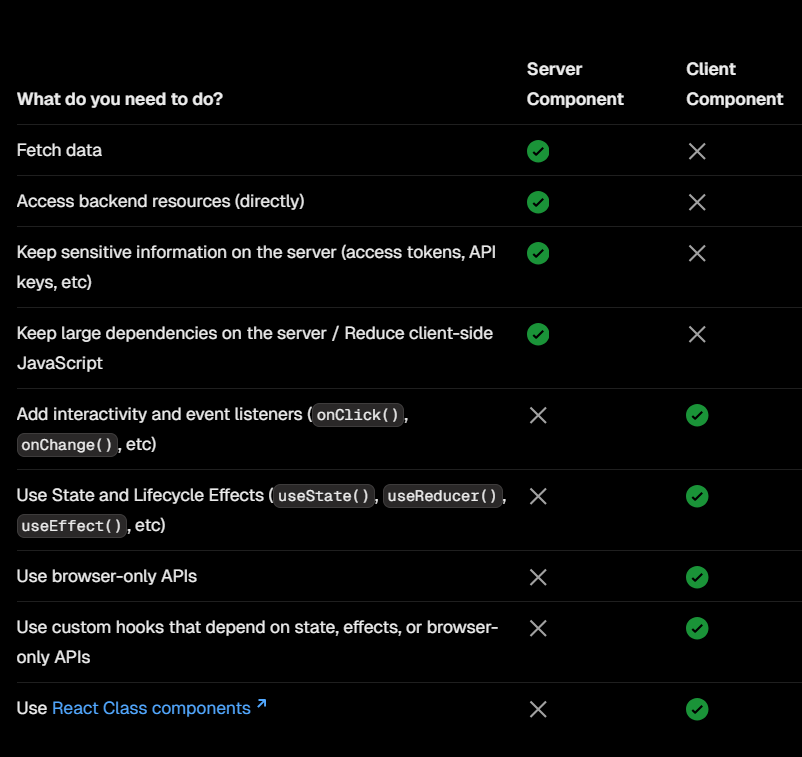

This is a [Next.js](https://nextjs.org) project bootstrapped with [`create-next-app`](https://github.com/vercel/next.js/tree/canary/packages/create-next-app).

## Getting Started

First, run the development server:

```bash
npm run dev
# or
yarn dev
# or
pnpm dev
# or
bun dev
```

Open [http://localhost:3000](http://localhost:3000) with your browser to see the result.

You can start editing the page by modifying `app/page.js`. The page auto-updates as you edit the file.

This project uses [`next/font`](https://nextjs.org/docs/app/building-your-application/optimizing/fonts) to automatically optimize and load [Geist](https://vercel.com/font), a new font family for Vercel.

## Learn More

To learn more about Next.js, take a look at the following resources:

- [Next.js Documentation](https://nextjs.org/docs) - learn about Next.js features and API.
- [Learn Next.js](https://nextjs.org/learn) - an interactive Next.js tutorial.

You can check out [the Next.js GitHub repository](https://github.com/vercel/next.js) - your feedback and contributions are welcome!

## Deploy on Vercel

The easiest way to deploy your Next.js app is to use the [Vercel Platform](https://vercel.com/new?utm_medium=default-template&filter=next.js&utm_source=create-next-app&utm_campaign=create-next-app-readme) from the creators of Next.js.

Check out our [Next.js deployment documentation](https://nextjs.org/docs/app/building-your-application/deploying) for more details.

## Chapter One ->File conversion

### 1.1 Not Found page -> not-found.js/not-found.jsx/not-found.tsx

The not-found file is used to render UI when the notFound function is thrown within a route segment. Along with serving a custom UI, Next.js will return a 200 HTTP status code for streamed responses, and 404 for non-streamed responses.`This component will be write in app route. Components name must be  {not-found.js/not-found.jsx/not-found.tsx} these formate`

```javascript
<div className="w-1/2 mx-auto">
  <h2>Not Found</h2>
  <p>Could not find requested resource</p>
  <Link href="/">Return Home</Link>
</div>
```

Note: If we have dynamic router it must validation for 404 page. so, we can `conditional randering`

```javascript
import React from "react";

export default function ServiceById({ params }) {
  const serviceData = [
    {
      id: "trpshg1kjfgh2348dflk2g",
      image: "/women.png", // Use the relative path to public folder
      serviceName: "Digital Marketing",
      serviceDetails:
        "We help you grow your business by creating effective digital marketing strategies that drive engagement and sales.",
    },
  ];
  const findService = serviceData.find((service) => params.id === service.id);
  if (findService) {
    return (
      <div>
        <h2>{findService.serviceName}</h2>
        
        <p>{findService.serviceDetails}</p>
      </div>
    );
  } else {
    return (
      <div className="w-1/2 mx-auto">
        <h2>Not Found</h2>
        <p>Could not find requested resource</p>
      </div>
    );
  }
}
```

### 1.2 Loading page -> loading.js/jsx/tsx

By default, this file is a Server Component - but can also be used as a Client Component through the "use client" directive.
Note: Loading UI components do not accept any parameters.

```javascript
export default function Loading() {
  // Or a custom loading skeleton component
  return <p>Loading...</p>;
}
```

## Chapter two -> Routing

### 2.1 `Creating a page`

A page is UI that is rendered on a specific route. To create a page, add a page file inside the app directory and default export a React component. For example, to create an index page (/):


### 2.2 `<Link> Component`

<Link> is a built-in component that extends the HTML <a> tag to provide prefetching and client-side navigation between routes. It is the primary and recommended way to navigate between routes in Next.js.

```javascript
import Link from "next/link";

const Navbar = () => {
  const links = [
    {
      title: "About",
      path: "/about",
    },
    {
      title: "Service",
      path: "/service",
    },
    {
      title: "Contact",
      path: "/contact",
    },
  ];

  const pathName = usePathname(); // This hood find the current path of the rounter and store in pathName varialable

  const userLoggin = false;

  console.log(pathName);

  const handleNavigation = () => {
    if (userLoggin) {
      route.push("/dashboard");
    } else {
      route.push("/");
    }
  };

  return (
    <nav className="bg-red-500 px-6 py-4 flex justify-between items-center">
      <h6>Logo</h6>
      <ul className="flex justify-between items-center space-x-4">
        {links.map((link) => (
          <Link
            className={`${
              pathName === link.path ? "text-white" : ""
            } hover:text-white`}
            key={link.title}
            href={link.path}
          >
            {link.title}
          </Link>
        ))}
      </ul>
    </nav>
  );
};

export default Navbar;
```

### 2.3 `useRouter() hook`

The useRouter hook allows you to programmatically change routes from Client Components.

```javascript
"use client";
import Link from "next/link";
import { usePathname, useRouter } from "next/navigation";

const Navbar = () => {
  const links = [
    {
      title: "About",
      path: "/about",
    },
    {
      title: "Service",
      path: "/service",
    },
    {
      title: "Contact",
      path: "/contact",
    },
  ];

  const pathName = usePathname();
  const route = useRouter(); // it must be import from next/navigation
  const userLoggin = false;

  console.log(pathName);

  const handleNavigation = () => {
    if (userLoggin) {
      route.push("/dashboard");
    } else {
      route.push("/");
    }
  };

  return (
    <nav className="bg-red-500 px-6 py-4 flex justify-between items-center">
      <h6>Logo</h6>
      <ul className="flex justify-between items-center space-x-4">
        {links.map((link) => (
          <Link
            className={`${
              pathName === link.path ? "text-white" : ""
            } hover:text-white`}
            key={link.title}
            href={link.path}
          >
            {link.title}
          </Link>
        ))}
        <button
          type="button"
          onClick={handleNavigation}
          className={`${
            pathName === "dashboard" ? "text-white" : ""
          } hover:text-white`}
        >
          Dashboard
        </button>
      </ul>
    </nav>
  );
};

export default Navbar;
```

### 2.4 `Dynamic Route`

A Dynamic Segment can be created by wrapping a folder's name in square brackets: [folderName]. For example, [id] or [slug].

Dynamic Segments are passed as the params prop to layout, page, route, and generateMetadata functions.
For example, a service could include the following route service/service/[slug]/page.js where [slug] is the Dynamic Segment for service page. Below example page in service/[id]/page.jsx

```javascript
export default function ServiceById({ params }) {
  const serviceData = [
    {
      id: "abchekdhw1dfdfoiefdfb",
      image: "/man.png", // Use the relative path to public folder
      serviceName: "Web Development",
      serviceDetails:
        "We provide custom web development services using modern technologies like React, Next.js, and Node.js.",
    },
    {
      id: "xzvtu7ujf9isjdu29gkrz",
      image: "/women.png", // Use the relative path to public folder
      serviceName: "Mobile App Development",
      serviceDetails:
        "Our team builds responsive and high-performance mobile apps for both Android and iOS platforms.",
    },
    {
      id: "qwsdfghy12jkl8plmno33z",
      image: "/man.png", // Use the relative path to public folder
      serviceName: "SEO Optimization",
      serviceDetails:
        "Boost your website's visibility with our SEO optimization services, ensuring better rankings and organic traffic.",
    },
    {
      id: "trpshg1kjfgh2348dflk2g",
      image: "/women.png", // Use the relative path to public folder
      serviceName: "Digital Marketing",
      serviceDetails:
        "We help you grow your business by creating effective digital marketing strategies that drive engagement and sales.",
    },
  ];
  const findService = serviceData.find((service) => params.id === service.id); // params.id contain the dymanic id
  console.log(findService);
  return (
    <div>
      <h2>{findService.serviceName}</h2>
      
      <p>{findService.serviceDetails}</p>
    </div>
  );
}
```

### 2.5 middleware

- Middleware executes before routes are rendered. It's particularly useful for implementing custom server-side logic like authentication, logging, or handling redirects.

- Use the file middleware.ts (or .js) in the root of your project to define Middleware. For example, at the same level as app or pages, or inside src if applicable.

- ### 2.5.1 `NextResponse.next()` is use pass the middleware check anything

  ```javascript
  import { NextResponse } from "next/server";
  export function middleware(request) {
    return NextResponse.next();
  }
  ```

- ### 2.5.2 `Check middleware and execute when middleware information valid`

  ```javascript
  import { NextResponse } from "next/server";
  export function middleware(request) {
    const isService = request.nextUrl.pathname.includes("/service");
    const dummyUser = {
      role: "admin",
      email: "omarfaruk65142@gmail.com",
    };
    const isAdmin = dummyUser.role === "admin";
    if (isService && !isAdmin) {
      return NextResponse.redirect(new URL("/login", request.url));
    }
    return NextResponse.next();
  }
  ```

## Chapter Three -> Randering

### When to use Server and Client Components?



### 3.1 Server Sider Randering

```javascript
export const getPosts = async () => {
  const res = await fetch("https://jsonplaceholder.typicode.com/posts");
  return res.json();
};

export default async function Posts() {
  const posts = await getPosts();

  return (
    <div>
      <h1 className="text-4xl py-3 text-blue-700 text-center">Posts</h1>
      <ul className="grid grid-cols-3 gap-5">
        {posts.map((post, index) => (
          <li
            key={post.id}
            className={`
                p-4 text-white
                ${index % 3 === 0 ? "bg-red-500" : ""}
                ${index % 3 === 1 ? "bg-green-500" : ""}
                ${index % 3 === 2 ? "bg-blue-500" : ""}
              `}
          >
            {post.title}
          </li>
        ))}
      </ul>
    </div>
  );
}
```

### 3.2 Client Side Randering

In next.js all components are server side randaring. If we want to try client side randering then we must be use `use client`

```javascript
"use client";
import React, { useEffect, useState } from "react";

export default function MealsPage() {
  const [searchMeals, setSearchMeals] = useState("");
  const [meals, setMeals] = useState([]);

  const fetchMeals = async () => {
    try {
      const res = await fetch(
        `https://www.themealdb.com/api/json/v1/1/search.php?s=${searchMeals}`
      );
      const data = await res.json();
      setMeals(data?.meals || []);
    } catch (error) {
      console.error("Error fetching meals:", error);
    }
  };

  useEffect(() => {
    fetchMeals();
  }, [searchMeals, meals]);

  useEffect(() => {
    console.log(meals);
  }, [meals]);

  return (
    <div>
      <h2 className="text-center">Search meals for your dinner</h2>
      <form className="text-center">
        <input
          type="text"
          value={searchMeals}
          onChange={(e) => setSearchMeals(e.target.value)}
          className="border border-red-600"
        />
      </form>
      <div className="mt-4 text-center">
        {meals.length > 0 ? (
          <ul>
            {meals.map((meal) => (
              <li key={meal.idMeal}>{meal.strMeal}</li>
            ))}
          </ul>
        ) : (
          <p>No meals found</p>
        )}
      </div>
    </div>
  );
}
```

### 3.3 If we look at the above table, we can see that `useState` and `useEffect` are used on the client side, while data fetching is done on the server side. Therefore, we need the following system.

### 3.3.1 Client side used for serverside randering

Note:

1. The `URLSearchParams`interface defines utility methods to work with the query string of a URL.

2. `router:` Used to programmatically navigate to different pages or update the URL.
3. `pathName:` Gets the current URL path.

```javascript
"use client";

import { usePathname, useRouter } from "next/navigation";
import { useEffect, useState } from "react";

export default function MealSearch() {
  const [searchMeals, setSearchMeals] = useState("");
  const router = useRouter();
  const pathName = usePathname();
  useEffect(() => {
    const searchQuery = { searchMeals };
    const urlQueryParam = new URLSearchParams(searchQuery);
    const url = `${pathName}?${urlQueryParam}`;
    router.push(url);
  }, [searchMeals]);
  return (
    <div>
      <form className="text-center">
        <input
          type="text"
          value={searchMeals}
          onChange={(e) => setSearchMeals(e.target.value)}
          className="border border-red-600"
        />
      </form>
    </div>
  );
}
```

### 3.3.2 Server-side rendering for fetching data based on the client-side input value.

Note:

1. `searchParams :` In Next.js (App Router), searchParams is used to fetch the client-side input value from the URL query parameters. This allows server-side rendering (SSR) or static generation (SSG) to use the client-side search input without relying on client-side state management.

```javascript
import Link from "next/link";
import MealSearch from "./components/MealSearch";

async function fetchMeals(searchQuery) {
  console.log(
    `https://www.themealdb.com/api/json/v1/1/search.php?s=${searchQuery}`
  );
  try {
    const res = await fetch(
      `https://www.themealdb.com/api/json/v1/1/search.php?s=${searchQuery}`
    );
    const data = await res.json();
    return data.meals || []; // Ensure it returns an array
  } catch (error) {
    console.error("Error fetching meals:", error);
    return [];
  }
}

export default async function MealsPage({ searchParams }) {
  const searchQuery = (await searchParams?.searchMeals) || "";
  const meals = await fetchMeals(searchQuery);

  return (
    <div>
      <h2 className="text-center">Search meals for your dinner</h2>
      <MealSearch />

      <div className="mt-4 text-center py-4">
        {meals.length > 0 ? (
          <div className="grid grid-cols-4 gap-3">
            {meals.map((meal) => (
              <div key={meal.idMeal} className="bg-green-600 p-4 rounded">
                <h2>{meal.strMeal}</h2>
                <h3>Category: {meal.strCategory}</h3>
                <div>
                  
                </div>
                <Link href={`/meal/${meal.idMeal}`} className="px-4">
                  <button className="bg-emerald-950 text-white px-4 py-2 mt-2 rounded">
                    View Details
                  </button>
                </Link>
              </div>
            ))}
          </div>
        ) : (
          <p>No meals found</p>
        )}
      </div>
    </div>
  );
}
```

## Chapter Four -> Optimizing

### 4.1 `Meta Data`

Next.js has a Metadata API that can be used to define your application metadata (e.g. meta and link tags inside your HTML head element) for improved SEO and web shareability.
There are two ways you can add metadata to your application:

- `Config-based Metadata:` Export a static metadata object or a dynamic generateMetadata function in a layout.js or page.js file.
- `File-based Metadata:` Add static or dynamically generated special files to route segments.

### 4.1.1 `Static Metadata`

To define static metadata, export a Metadata object from a layout.js or static page.js file.

```javascript
export const metadata = {
  title: "Learning Next.js",
  description: "Here I try to Learn Next.js for my carrier build-up",
};
```

### 4.1.2 `Dynamic metaData use as templete`

```javascript
export const metadata = {
  title: {
    default: "Learning Next.js",
    template: "%s | Learning Next.js",
  },
  description: "Here I try to Learn Next.js for my carrier build-up",
};
```
